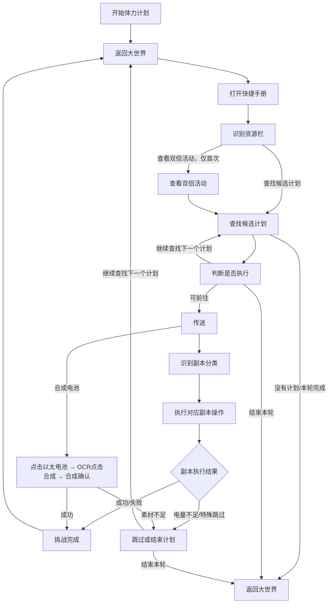

# 体力计划运行流程

## 概述

体力计划（ChargePlanApp）是一个自动化执行各种副本挑战的应用，支持实战模拟室、区域巡防、专业挑战室、恶名狩猎，以及从快捷手册进入的合成电池。该应用采用基于状态机的节点图执行模式，能够智能管理电量、自动恢复电量、循环执行计划等。

## 配置项

- **循环执行**：除本次已跳过的代理人计划外，其余计划达到计划次数后进入下一轮；普通计划按计划次数扣减，已跳过的代理人计划清零。
- **跳过计划**：当前计划因电量不足或次数限制无法继续时，继续尝试后续计划。
- **每日重置**：按游戏刷新日每天首次运行前清零所有计划的已运行次数。
- **恢复电量**：体力不足时按配置使用储蓄电量、以太电池或两者。
- **双倍活动**：开启后在每次运行首次打开快捷手册时检查实战模拟室双倍次数；命中时生成临时计划优先执行，不写入正式计划列表。
- **合成电池**：固定需要 60 电量；进入“传送”节点后按分类分流，点击快捷手册资源栏的以太电池区域，再用全屏 OCR 点击“合成”进入道具处理界面。按一次最大批量合成计一次计划，合成素材不足时遵循“跳过计划”配置。

## 主要流程

### 1. 初始化阶段

```
开始体力计划 → 返回大世界 → 打开快捷手册 → 识别资源栏 → [查看双倍活动] → 查找候选计划 → 判断是否执行
```

**关键逻辑**：
- 重置上次尝试的计划（`last_tried_plan = None`）
- 如果开启“每日重置”，按游戏刷新日每天首次运行前清零所有计划的已运行次数
- 返回大世界后，打开大世界右侧快捷手册入口
- 从快捷手册右上角资源栏一次性识别当前电量、储蓄电量和以太电池数量
- 开启双倍活动时，首次识别资源栏后检查双倍次数，生成临时计划（`temp_plan`）优先执行；后续 skip 循环不再重复检查
- 查找下一个候选计划，再根据当前电量、恢复资源和跳过配置判断是否执行
- 选择“合成电池”时先进入“传送”节点，再由该节点按分类分流到电池合成流程；普通计划则继续执行副本传送

### 2. 任务选择逻辑

**电量预估机制**：
- **实战模拟室**：根据卡片数量计算（`卡片数量 × 20`电量）
- **实战模拟室默认数量**：进本前按 20 电量预估
- **区域巡防**：固定需要60电量
- **专业挑战室**：固定需要40电量
- **恶名狩猎**：固定需要60电量
- **合成电池**：固定需要 60 电量
- **特殊情况**：未知类型预估为0，交给副本内流程继续判断

**任务筛选流程**：
1. 检查所有计划是否完成，如果完成且开启循环模式则重置计划
2. 获取下一个未完成的计划项
3. 计算所需电量并与当前电量比较
4. 如果电量不足：
   - 快捷手册预读到的恢复资源足够补齐缺口：继续前往副本，由副本内恢复弹窗执行真实恢复
   - 无法通过当前配置的恢复资源补齐且允许跳过：跳过当前计划继续下一个
   - 无法通过当前配置的恢复资源补齐且不允许跳过：结束本轮计划
5. 如果电量充足：设置为当前执行计划并继续传送

### 3. 传送与副本执行

```
传送 → 识别副本分类 → [具体副本操作] → 挑战完成
```

**传送阶段**：
- “合成电池”在传送节点按分类分流到电池合成操作，不创建快捷手册副本传送操作
- 普通计划使用快捷手册传送到指定副本位置
- 根据计划配置的标签页、分类、副本类型进行精确传送

**副本分类识别**：
- 根据传送结果识别当前副本类型
- 分发到对应的副本处理节点

### 4. 各副本类型的电量处理逻辑

#### 4.1 实战模拟室（CombatSimulation）

**电量检查流程**：
```
等待入口加载 → 选择类型/副本 → 选择卡片数量 → 下一步 → 恢复电量/出战
```

**电量处理逻辑**：
- 进本前已按计划卡片数量预估电量，默认数量按20电量预估
- 进入副本后点击“下一步”，如果出现恢复电量页，则返回电量不足状态
- 未出现恢复电量页且识别到“出战”后继续战斗流程

**电量不足处理**：
- 检查恢复电量配置，如果允许则调用恢复电量操作
- 否则返回电量不足状态，由上层处理

#### 4.2 区域巡防（AreaPatrol）

**电量检查流程**：
```
等待入口加载 → 下一步 → 恢复电量/出战
```

**家政券处理**：
- 2.5版本已移除家政券功能，当前区域巡防流程跳过家政券节点

**电量处理逻辑**：
- 进本前按60电量预估
- 进入副本后点击“下一步”，如果出现恢复电量页，则返回电量不足状态

#### 4.3 专业挑战室（ExpertChallenge）

**电量检查流程**：
```
等待入口加载 → 关闭燃竭模式 → 下一步 → 恢复电量/出战
```

**特殊处理**：
- 自动关闭深度追猎模式（燃竭模式）
- 进本前按40电量预估
- 进入副本后点击“下一步”，如果出现恢复电量页，则返回电量不足状态

#### 4.4 恶名狩猎（NotoriousHunt）

**电量检查流程**：
```
等待入口加载 → 选择副本 → 抉择深度追猎 → 选择难度 → 下一步 → 恢复电量/出战
```

**深度追猎模式**：
- 体力计划调用恶名狩猎时传入`use_charge_power=True`，优先走深度追猎
- 如果仍有周期挑战奖励次数，深度追猎会被跳过，父流程会标记当前计划跳过后继续后续计划

**电量处理逻辑**：
- 进本前按60电量预估
- 深度追猎下点击“下一步”，如果出现恢复电量页，则返回电量不足状态
- 非体力计划的普通恶名狩猎仍按奖励次数运行

### 5. 战斗执行流程

```
选择预备编队 → 出战 → 加载自动战斗指令 → 等待战斗画面 → 自动战斗 → 战斗结束 → 判断下一次
```

**通用战斗流程**：
1. **选择预备编队**：根据计划配置选择指定编队
2. **出战**：点击出战按钮进入战斗
3. **加载自动战斗指令**：根据编队或计划配置加载对应的自动战斗脚本
4. **等待战斗画面**：等待战斗界面完全加载
5. **自动战斗**：执行自动战斗逻辑，监控战斗状态
6. **战斗结束**：战斗完成后更新运行次数
7. **判断下一次**：根据剩余次数决定是否继续战斗

### 6. 电量不足处理

**电量不足触发条件**：
- 进本前预估电量不足，且快捷手册预读到的恢复资源无法补齐缺口
- 各副本操作返回`STATUS_CHARGE_NOT_ENOUGH`状态
- 传送失败且状态为`找不到 代理人方案培养`
- 恶名狩猎仍有周期挑战奖励次数时跳过深度追猎

**处理策略**：
- **进本前预估电量不足且可跳过**：标记当前计划为本次运行跳过，继续查找后续计划
- **副本返回跳过节点**：标记当前计划为本次运行跳过，继续查找下一个计划
- **代理人方案培养**、**恶名狩猎仍有奖励次数**：即使未开启跳过计划，也会跳过当前计划
- **非跳过模式**：直接结束本轮计划执行

### 7. 电量恢复机制

**恢复电量触发**：
- 任务选择阶段只使用快捷手册资源栏预读结果判断是否值得进副本
- 各副本内点击“下一步”后出现恢复电量页，且配置了恢复电量

**恢复电量逻辑**：
- `RestoreCharge`只处理副本内或战斗后真实出现的恢复电量弹窗
- 副本内恢复按当前界面重新选择恢复来源
- 恢复失败或恢复后仍不足时，按电量不足处理

### 8. 循环与结束

**循环条件**：
- 配置了循环模式（`loop=True`）
- 除本次已跳过的代理人计划外，其余计划均已完成
- 进入下一轮时，普通计划按整轮扣减并保留超出次数，已跳过的代理人计划清零

**每日清零**：
- “每日重置”独立于循环模式，默认关闭
- 开启后按游戏刷新日每天首次运行前将所有计划的已运行次数清零
- 同一天重复运行不会再次清零，循环模式仍按一轮计划完成后的扣减逻辑继续

**结束条件**：
- 所有计划完成且未配置循环模式
- 电量不足且无法恢复
- 出现不可恢复的错误

**结束处理**：
```
返回大世界 → 保存通知截图 → 发送完成通知
```

## 状态流转图



## 关键特性

1. **智能电量管理**：预估电量需求，动态检查实际消耗
2. **灵活的恢复机制**：支持多种电量恢复策略
3. **容错处理**：支持计划跳过、重试机制
4. **循环执行**：支持计划完成后自动重置循环
5. **每日清零**：可按游戏刷新日重置已运行次数
6. **多副本支持**：统一的流程框架适配不同副本类型
7. **状态持久化**：记录执行进度，支持断点续传
